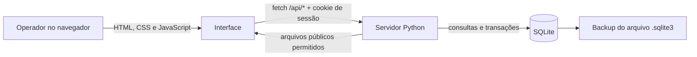

# Documentação completa — Banca Fácil

Este documento explica como instalar, usar, manter, testar e evoluir o Banca Fácil. Ele também descreve a arquitetura, o banco de dados, a API, as decisões de segurança e os limites atuais do projeto.

> **Resumo:** o Banca Fácil é um sistema local de frente de caixa e estoque. A interface roda no navegador, a API roda em Python e os dados ficam em um arquivo SQLite na própria instalação.

## Sumário

1. [Links importantes](#1-links-importantes)
2. [O que o sistema faz](#2-o-que-o-sistema-faz)
3. [Primeira utilização](#3-primeira-utilização)
4. [Instalação detalhada](#4-instalação-detalhada)
5. [Como usar cada área](#5-como-usar-cada-área)
6. [Arquitetura](#6-arquitetura)
7. [Arquivos do projeto](#7-arquivos-do-projeto)
8. [Banco de dados](#8-banco-de-dados)
9. [API HTTP](#9-api-http)
10. [Autenticação e sessões](#10-autenticação-e-sessões)
11. [Regras de negócio](#11-regras-de-negócio)
12. [PIX](#12-pix)
13. [Relatórios e CSV](#13-relatórios-e-csv)
14. [Configuração do servidor](#14-configuração-do-servidor)
15. [Backup, restauração e reinicialização](#15-backup-restauração-e-reinicialização)
16. [Testes e validação](#16-testes-e-validação)
17. [Segurança](#17-segurança)
18. [Publicação e produção](#18-publicação-e-produção)
19. [Solução de problemas](#19-solução-de-problemas)
20. [Como desenvolver novas funcionalidades](#20-como-desenvolver-novas-funcionalidades)
21. [Checklist antes de usar em uma banca real](#21-checklist-antes-de-usar-em-uma-banca-real)
22. [Referências oficiais](#22-referências-oficiais)

## 1. Links importantes

- [Repositório no GitHub](https://github.com/brnpessoa14/estoque-banca)
- [Pull request com a implementação completa](https://github.com/brnpessoa14/estoque-banca/pull/1)
- [Início rápido](QUICKSTART.md)
- [Resumo do projeto](README.md)
- [Servidor, API e banco](start.py)
- [Interface HTML](index.html)
- [Lógica da interface](app.js)
- [Estilos e responsividade](styles.css)
- [Testes de integração](tests/test_app.py)
- [Download oficial do Python](https://www.python.org/downloads/)

## 2. O que o sistema faz

O Banca Fácil reúne quatro áreas principais:

### Frente de caixa

- Exibe produtos por categoria;
- busca por nome, categoria ou código de barras;
- monta um carrinho;
- controla quantidades sem ultrapassar o estoque;
- finaliza vendas em PIX, dinheiro, débito ou crédito;
- reduz o estoque automaticamente;
- mostra faturamento, atendimentos do dia e alertas de reposição.

### Produtos e estoque

- Cadastra produtos;
- edita nome, categoria, código de barras, preço e quantidades;
- exclui produtos sem apagar o histórico das vendas anteriores;
- mostra valor estimado do estoque;
- filtra produtos disponíveis, baixos ou esgotados.

### Relatórios

- Filtra vendas por período;
- calcula faturamento, quantidade de vendas e ticket médio;
- resume formas de pagamento;
- cria ranking dos produtos mais vendidos;
- exibe histórico e atividades da conta;
- exporta as vendas em CSV.

### Configurações

- Define o nome da banca;
- configura recebedor, cidade e chave PIX;
- armazena um número de WhatsApp;
- permite trocar a senha da conta.

## 3. Primeira utilização

### Conta pronta

Na primeira inicialização, o banco cria automaticamente esta conta:

```text
E-mail: cliente@bancafacil.com.br
Senha:  Cliente@123
```

Ela inclui seis produtos de demonstração. Essa senha é pública e serve apenas para o primeiro acesso. Antes de usar a conta com dados reais:

1. entre na conta;
2. abra **Configurações**;
3. troque a senha;
4. revise a chave PIX;
5. edite ou remova os produtos de exemplo.

Também é possível selecionar **Criar conta** na tela inicial. Cada conta possui produtos, vendas, configurações e atividades separados.

### Inicialização rápida

No macOS ou Linux:

```bash
cd /caminho/do/estoque-banca
python3 start.py
```

No Windows, abra a pasta no Prompt de Comando e execute:

```bat
start.bat
```

O endereço padrão é [http://127.0.0.1:8000](http://127.0.0.1:8000).

> Não abra `index.html` diretamente. O navegador precisa se comunicar com a API de `start.py` para fazer login e acessar o banco.

## 4. Instalação detalhada

### Requisitos

- Python 3.9 ou superior;
- navegador moderno, como Chrome, Edge, Firefox ou Safari;
- espaço em disco para o banco e seus backups;
- internet apenas para carregar a biblioteca visual do QR Code. O restante da aplicação funciona localmente.

O projeto usa somente módulos da biblioteca padrão do Python. Não existe `npm install`, `pip install` ou serviço de banco obrigatório.

### macOS

1. Verifique o Python:

   ```bash
   python3 --version
   ```

2. Entre na pasta do projeto e execute:

   ```bash
   python3 start.py
   ```

### Linux

Use o Python fornecido pela distribuição:

```bash
python3 --version
python3 start.py
```

### Windows

1. Instale o Python pelo [site oficial](https://www.python.org/downloads/windows/).
2. Durante a instalação, habilite a opção para adicionar o Python ao `PATH`.
3. Execute `start.bat` ou:

   ```bat
   python start.py
   ```

A documentação oficial contém mais detalhes sobre [Python no Windows](https://docs.python.org/3/using/windows.html).

### Confirmar que o servidor está saudável

Com o sistema em execução, acesse:

```text
http://127.0.0.1:8000/api/health
```

Resposta esperada:

```json
{"ok":true,"database":"connected"}
```

## 5. Como usar cada área

### 5.1 Criar uma conta

1. Na tela inicial, selecione **Criar conta**.
2. Informe nome, e-mail e senha.
3. A senha deve ter pelo menos oito caracteres, uma letra e um número.
4. Após o cadastro, a sessão é iniciada automaticamente.

Uma conta nova começa sem produtos e com configurações básicas.

### 5.2 Cadastrar produtos

1. Abra **Produtos e estoque**.
2. Selecione **Novo produto**.
3. Preencha:
   - nome;
   - categoria;
   - código de barras opcional;
   - preço de venda;
   - estoque atual;
   - estoque mínimo.
4. Salve.

Quando o estoque fica igual ou abaixo do mínimo, o sistema marca o produto como baixo. Com estoque zero, ele fica indisponível no caixa.

### 5.3 Registrar uma venda

1. Abra **Frente de caixa**.
2. Localize os produtos pela busca ou categoria.
3. Clique em cada produto para adicioná-lo ao carrinho.
4. Ajuste as quantidades com `+` e `−`.
5. Selecione **Finalizar venda**.
6. Escolha PIX, dinheiro, débito ou crédito.

O servidor consulta novamente preços e estoques. Portanto, alterar valores enviados pelo navegador não altera o total calculado pelo backend.

### 5.4 Gerar uma cobrança PIX

1. Cadastre uma chave PIX em **Configurações**.
2. Monte o carrinho.
3. Selecione **Gerar cobrança PIX**.
4. Mostre o QR Code ao cliente ou copie o código.
5. Confirme o recebimento no aplicativo bancário.
6. Volte ao caixa e finalize a venda com a forma de pagamento PIX.

### 5.5 Consultar relatórios

1. Abra **Relatórios**.
2. Escolha as datas inicial e final.
3. Selecione **Aplicar período**.
4. Para salvar os dados, use **Exportar CSV**.

O arquivo CSV pode ser aberto no Excel, LibreOffice Calc ou Google Planilhas.

## 6. Arquitetura



### Componentes

| Camada | Tecnologia | Responsabilidade |
|---|---|---|
| Interface | HTML e CSS | Estrutura, acessibilidade, visual e responsividade |
| Aplicação no navegador | JavaScript | Estado do carrinho, renderização, formulários, relatórios e chamadas HTTP |
| Backend | Python 3 | Rotas, autenticação, validação, regras de negócio e arquivos públicos |
| Persistência | SQLite | Usuários, sessões, produtos, vendas, configurações e auditoria |
| QR Code | qrcodejs 1.0.0 | Renderização visual do payload PIX no navegador |

### Fluxo de uma requisição autenticada

1. O navegador envia uma requisição `fetch` para `/api/...`.
2. O cookie `banca_session` é enviado automaticamente.
3. O servidor transforma o token em SHA-256 e procura a sessão no banco.
4. Se a sessão for válida, o servidor obtém o usuário.
5. Todas as consultas incluem o `user_id` desse usuário.
6. A resposta retorna JSON.
7. O JavaScript atualiza a tela.

## 7. Arquivos do projeto

| Arquivo | Função | Quando alterar |
|---|---|---|
| [`index.html`](index.html) | Estrutura de todas as telas e modais | Ao adicionar campos, seções ou elementos visuais |
| [`styles.css`](styles.css) | Cores, layout, tabelas, cartões e breakpoints | Ao mudar aparência ou responsividade |
| [`app.js`](app.js) | Estado do frontend, eventos, chamadas da API, PIX e CSV | Ao mudar interação ou consumo da API |
| [`start.py`](start.py) | Servidor, schema, autenticação, API e regras de negócio | Ao mudar banco, segurança ou comportamento do servidor |
| [`tests/test_app.py`](tests/test_app.py) | Testes HTTP de integração | Sempre que uma regra ou endpoint mudar |
| [`start.bat`](start.bat) | Inicialização no Windows | Se o comando de inicialização mudar |
| [`README.md`](README.md) | Apresentação e comandos essenciais | Ao mudar recursos ou requisitos |
| [`QUICKSTART.md`](QUICKSTART.md) | Primeiro acesso resumido | Ao mudar instalação ou credenciais iniciais |
| [`.gitignore`](.gitignore) | Impede banco, cache e segredos de entrar no Git | Ao introduzir novos artefatos locais |

Arquivos públicos servidos pelo backend:

- `/index.html`
- `/styles.css`
- `/app.js`

Qualquer outro caminho de arquivo recebe HTTP `404`. Isso impede o download do SQLite, do código Python, dos testes e do diretório `.git` pelo navegador.

## 8. Banco de dados

### Localização

Por padrão:

```text
data/banca.sqlite3
```

O diretório e o banco são criados automaticamente. O arquivo está no `.gitignore` e nunca deve ser enviado ao GitHub.

### Tabelas

| Tabela | Conteúdo | Relação principal |
|---|---|---|
| `users` | Nome, e-mail, salt, hash e fator de trabalho da senha | Uma linha por conta |
| `sessions` | Hash do token, validade e usuário | Muitas sessões para um usuário |
| `products` | Produto, categoria, preço em centavos e estoque | Pertence a um usuário |
| `sales` | Total, pagamento e data | Pertence a um usuário |
| `sale_items` | Produto vendido, quantidade e preço congelado | Pertence a uma venda |
| `settings` | Dados da banca e PIX | Uma linha por usuário |
| `activity_logs` | Ações relevantes e datas | Pertence a um usuário |

### Relacionamentos

```text
users 1 ─── N sessions
users 1 ─── N products
users 1 ─── N sales 1 ─── N sale_items
users 1 ─── 1 settings
users 1 ─── N activity_logs
```

### Valores monetários

Preços e totais são armazenados como inteiros em centavos:

```text
R$ 39,90 → 3990
```

Isso evita erros de arredondamento comuns em números de ponto flutuante.

### Exclusão de produto

Ao excluir um produto, os itens de vendas anteriores permanecem. `sale_items` guarda o nome e o preço utilizados no momento da venda, e a referência ao produto pode ficar nula.

### Transação de venda

A venda usa `BEGIN IMMEDIATE` e só é confirmada se todas as etapas funcionarem:

1. valida cada produto;
2. confirma que pertence ao usuário;
3. verifica o estoque;
4. calcula o total com o preço do banco;
5. cria a venda;
6. cria os itens;
7. reduz o estoque;
8. grava a atividade;
9. executa `commit`.

Se qualquer etapa falhar, o SQLite desfaz a operação. Assim, não existe venda salva com baixa de estoque incompleta.

## 9. API HTTP

Todas as respostas da API usam JSON. As rotas protegidas exigem o cookie de sessão.

### Endpoints

| Método | Rota | Login | Finalidade |
|---|---|---:|---|
| `GET` | `/api/health` | Não | Verifica servidor e banco |
| `POST` | `/api/auth/register` | Não | Cria uma conta e inicia sessão |
| `POST` | `/api/auth/login` | Não | Autentica e cria sessão |
| `POST` | `/api/auth/logout` | Não | Revoga a sessão e limpa o cookie |
| `GET` | `/api/auth/me` | Sim | Retorna o usuário atual |
| `GET` | `/api/bootstrap` | Sim | Carrega todos os dados necessários para a interface |
| `POST` | `/api/products` | Sim | Cria um produto |
| `PATCH` | `/api/products/{id}` | Sim | Atualiza um produto |
| `DELETE` | `/api/products/{id}` | Sim | Exclui um produto |
| `POST` | `/api/sales` | Sim | Registra venda e reduz estoque |
| `PUT` | `/api/settings` | Sim | Atualiza dados da banca |
| `PUT` | `/api/account/password` | Sim | Troca a senha e encerra outras sessões |

### Cadastro

```http
POST /api/auth/register
Content-Type: application/json

{
  "name": "Maria Souza",
  "email": "maria@example.com",
  "password": "Senha1234"
}
```

### Login com `curl`

O exemplo guarda o cookie em um arquivo temporário:

```bash
curl -i \
  -c /tmp/banca-cookies.txt \
  -H 'Content-Type: application/json' \
  -d '{"email":"cliente@bancafacil.com.br","password":"Cliente@123"}' \
  http://127.0.0.1:8000/api/auth/login
```

Carregar os dados autenticados:

```bash
curl -b /tmp/banca-cookies.txt \
  http://127.0.0.1:8000/api/bootstrap
```

Nunca compartilhe o arquivo de cookie enquanto a sessão estiver ativa.

### Criar produto

```json
{
  "name": "Água mineral 500ml",
  "category": "Bebidas",
  "barcode": "789100000003",
  "price": 4.50,
  "stock": 24,
  "minStock": 8
}
```

### Registrar venda

```json
{
  "paymentMethod": "pix",
  "items": [
    {"productId": "UUID-DO-PRODUTO", "quantity": 2}
  ]
}
```

Formas aceitas:

- `pix`
- `dinheiro`
- `debito`
- `credito`

### Códigos HTTP comuns

| Código | Significado no projeto |
|---:|---|
| `200` | Operação concluída |
| `201` | Conta, produto ou venda criado |
| `400` | Dados inválidos |
| `401` | Credenciais inválidas ou sessão expirada |
| `403` | Origem da requisição não autorizada |
| `404` | Rota, arquivo ou produto não encontrado |
| `409` | Conflito, como e-mail repetido ou estoque insuficiente |
| `415` | Corpo enviado sem `application/json` |
| `500` | Erro interno inesperado |

## 10. Autenticação e sessões

### Senhas

O servidor nunca armazena a senha original. Ele usa:

- PBKDF2-HMAC-SHA256;
- 600.000 iterações para novas senhas;
- salt aleatório de 16 bytes por usuário;
- comparação resistente a diferenças de tempo com `hmac.compare_digest`.

Bancos criados pela versão anterior mantêm 310.000 iterações por senha até que o usuário faça a troca. O fator fica registrado em `password_iterations`, permitindo verificar hashes antigos e atualizar novas senhas sem bloquear contas existentes.

### Sessões

No login:

1. o servidor gera um token aleatório com `secrets.token_urlsafe(40)`;
2. envia o token em um cookie;
3. grava somente o SHA-256 do token no SQLite;
4. define validade de sete dias.

O cookie possui:

- `HttpOnly`: JavaScript não consegue ler o token;
- `SameSite=Strict`: reduz o envio em requisições entre sites;
- `Path=/`: vale para toda a aplicação;
- `Max-Age`: controla a expiração.

Quando a senha é alterada, as outras sessões daquela conta são revogadas. A sessão usada para realizar a troca continua válida.

### Isolamento entre contas

O ID do usuário não é aceito do navegador para decidir propriedade. O backend obtém o usuário pela sessão e aplica `user_id` nas consultas. Os testes confirmam que uma conta não consegue listar ou editar os produtos de outra.

## 11. Regras de negócio

### Produtos

- Nome: 2 a 100 caracteres;
- categoria: 2 a 50 caracteres;
- código de barras: até 40 caracteres;
- preço: de zero até R$ 1.000.000,00;
- estoque e mínimo: inteiros de zero até 1.000.000.

### Estoque

- Não aceita quantidade negativa;
- não permite adicionar ao carrinho mais do que existe;
- repete a validação no servidor ao fechar a venda;
- estoque baixo significa `stock <= min_stock`;
- estoque zero desabilita o produto no catálogo.

### Vendas

- Uma venda deve ter ao menos um item;
- aceita no máximo 100 linhas de itens por requisição;
- quantidades repetidas do mesmo produto são somadas;
- o preço é sempre lido do banco;
- uma venda não pode ser editada ou excluída pela interface atual;
- o histórico preserva nome e preço utilizados na venda.

### Conta

- E-mail é normalizado para letras minúsculas;
- e-mail deve ser único;
- senha exige no mínimo oito caracteres, uma letra e um número;
- ainda não existe recuperação de senha por e-mail.

## 12. PIX

O frontend monta um QR Code estático no padrão BR Code, incluindo:

- chave PIX;
- nome do recebedor;
- cidade;
- valor do carrinho;
- identificador `***`;
- CRC16 do payload.

O [Manual de Padrões para Iniciação do Pix do Banco Central](https://www.bcb.gov.br/content/estabilidadefinanceira/pix/Regulamento_Pix/II_ManualdePadroesparaIniciacaodoPix.pdf) é a referência oficial do formato.

### Limitação importante

O sistema gera a cobrança, mas não consulta o banco e não confirma o pagamento automaticamente. O operador deve verificar o recebimento no aplicativo bancário antes de finalizar a venda.

A imagem do QR Code usa uma biblioteca carregada do CDN jsDelivr. Sem internet, o sistema mantém o código PIX Copia e Cola, mas pode não renderizar a imagem.

## 13. Relatórios e CSV

Os relatórios são calculados no navegador a partir de até 500 vendas recentes devolvidas por `/api/bootstrap`.

O CSV contém:

- data;
- ID da venda;
- pagamento;
- produto;
- quantidade;
- preço unitário;
- total da venda.

O delimitador é ponto e vírgula e o arquivo inclui BOM UTF-8 para melhorar a abertura no Excel em português.

### Limitação de escala

Como o bootstrap limita o histórico retornado a 500 vendas, relatórios muito antigos podem não aparecer após o sistema ultrapassar esse volume. Para uma operação maior, crie um endpoint de relatório paginado e faça os cálculos no servidor.

## 14. Configuração do servidor

### Argumentos

```bash
python3 start.py --help
python3 start.py --no-browser
python3 start.py --port 9000
python3 start.py --host 127.0.0.1
python3 start.py --db /caminho/seguro/banca.sqlite3
```

| Argumento | Padrão | Descrição |
|---|---|---|
| `--host` | `127.0.0.1` | Endereço em que o servidor escuta |
| `--port` | `8000` | Porta HTTP |
| `--db` | `data/banca.sqlite3` | Caminho do SQLite |
| `--no-browser` | desativado | Impede a abertura automática do navegador |

### Variáveis de ambiente

| Variável | Exemplo | Efeito |
|---|---|---|
| `PDV_HOST` | `127.0.0.1` | Define o host |
| `PDV_PORT` | `9000` | Define a porta |
| `PDV_DB_PATH` | `/dados/banca.sqlite3` | Define o banco |
| `PDV_OPEN_BROWSER` | `0` | Não abre o navegador |

Exemplo:

```bash
PDV_PORT=9000 PDV_OPEN_BROWSER=0 python3 start.py
```

## 15. Backup, restauração e reinicialização

### Backup simples com o servidor parado

1. Encerre com `Ctrl+C`.
2. Copie estes arquivos, caso existam:

   ```text
   data/banca.sqlite3
   data/banca.sqlite3-wal
   data/banca.sqlite3-shm
   ```

3. Guarde a cópia em local seguro e, de preferência, criptografado.

Com o servidor encerrado normalmente, o arquivo principal costuma conter o estado consolidado. Copiar todo o conjunto evita inconsistências caso a aplicação não tenha sido encerrada corretamente.

### Backup consistente pelo Python

O módulo `sqlite3` possui uma API de backup. Com o servidor parado, execute:

```bash
python3 - <<'PY'
import sqlite3

source = sqlite3.connect("data/banca.sqlite3")
target = sqlite3.connect("backup-banca.sqlite3")
with target:
    source.backup(target)
source.close()
target.close()
print("Backup concluído: backup-banca.sqlite3")
PY
```

Veja a [documentação do `sqlite3.Connection.backup`](https://docs.python.org/3/library/sqlite3.html#sqlite3.Connection.backup) e a [SQLite Backup API](https://www.sqlite.org/backup.html).

### Restaurar

1. Pare o servidor.
2. Renomeie o banco atual para preservar uma cópia.
3. Coloque o backup no caminho configurado.
4. Inicie o servidor.
5. Teste login, produtos e relatórios.

### Recomeçar com banco vazio

Para não perder dados acidentalmente, mova o banco em vez de apagá-lo:

```bash
mv data/banca.sqlite3 data/banca.sqlite3.anterior
python3 start.py
```

Uma nova base será criada com a conta demo. No Windows, renomeie o arquivo pelo Explorador antes de iniciar novamente.

## 16. Testes e validação

### Executar todos os testes

```bash
python3 -m unittest discover -s tests -v
```

### Verificar sintaxe Python

```bash
python3 -m py_compile start.py tests/test_app.py
```

### O que os testes cobrem

- saúde da API;
- bloqueio de rota protegida sem login;
- bloqueio HTTP de banco, `.git`, servidor e testes;
- conta demo e produtos iniciais;
- rejeição de senha incorreta;
- criação de conta;
- criação e edição de produto;
- venda e baixa de estoque;
- rollback quando o estoque é insuficiente;
- isolamento entre duas contas;
- configurações;
- troca de senha;
- revogação de outras sessões;
- logout.

### Checklist manual recomendado

1. Teste login e cadastro.
2. Cadastre, edite e exclua um produto.
3. Faça uma venda em cada forma de pagamento.
4. Tente vender quantidade acima do estoque.
5. Gere e leia um QR Code PIX com um aplicativo bancário sem confirmar o pagamento.
6. Exporte e abra o CSV.
7. Teste em tela de celular.
8. Reinicie o servidor e confirme que os dados permaneceram.
9. Restaure um backup em ambiente de teste.

## 17. Segurança

### Proteções implementadas

- Hash lento e salt individual para senhas;
- tokens de sessão criptograficamente aleatórios;
- apenas hash do token persistido;
- cookie HttpOnly e SameSite Strict;
- validade da sessão no servidor;
- revogação de sessão no logout;
- revogação de outras sessões na troca de senha;
- checagem de origem em operações mutáveis;
- limite de 1 MB para corpos JSON;
- consultas parametrizadas no SQLite;
- validação de todos os dados no servidor;
- preço e total calculados no backend;
- isolamento por usuário;
- transação atômica de venda;
- escape de conteúdo exibido no HTML;
- Content Security Policy;
- bloqueio de frames, MIME sniffing, câmera, microfone e geolocalização;
- `Cache-Control: no-store` nas respostas JSON;
- lista explícita de arquivos públicos.

### O que ainda é necessário para internet pública

- HTTPS obrigatório;
- atributo `Secure` no cookie;
- servidor de produção em vez de `http.server`;
- limitação de tentativas de login por IP e conta;
- recuperação de senha segura;
- autenticação multifator, se o risco exigir;
- logs e alertas centralizados;
- política de retenção e privacidade;
- backups automáticos e testados;
- atualizações de dependências e sistema operacional;
- revisão de LGPD para os dados do estabelecimento e clientes.

O servidor padrão escuta somente em `127.0.0.1`, reduzindo a exposição. Não use `--host 0.0.0.0` fora de uma rede confiável sem firewall e HTTPS.

## 18. Publicação e produção

### Uso recomendado da versão atual

A versão atual foi desenhada para uma banca usando um computador local. O processo Python deve permanecer aberto enquanto o sistema estiver em uso, e o arquivo SQLite deve estar em disco persistente.

### Vercel

O frontend pode aparecer em um preview da Vercel, mas a arquitetura atual não funciona integralmente como site estático: `start.py` é um servidor contínuo e o SQLite precisa de armazenamento persistente.

As [Vercel Functions têm sistema de arquivos somente leitura e `/tmp` temporário](https://vercel.com/docs/functions/runtimes). Para usar Vercel de verdade, seria necessário:

1. adaptar a API para o formato de [Vercel Python Functions](https://vercel.com/docs/functions/runtimes/python);
2. trocar SQLite local por um banco externo persistente, como PostgreSQL gerenciado;
3. configurar variáveis de ambiente;
4. habilitar HTTPS e cookie `Secure`;
5. criar migrações e processo seguro de seed.

Não coloque o arquivo SQLite dentro do Git para tentar publicá-lo.

### Servidor próprio ou máquina virtual

Para hospedar sem mudar o SQLite:

1. use disco persistente;
2. execute o processo por um gerenciador de serviços;
3. coloque um proxy reverso com HTTPS na frente;
4. limite acesso por firewall;
5. automatize backups;
6. monitore espaço, erros e disponibilidade.

O próprio Python alerta que [`http.server` não é recomendado para produção](https://docs.python.org/3/library/http.server.html). Para internet pública, migre a aplicação para um servidor WSGI/ASGI mantido para produção.

### GitHub e pull request

As alterações estão no [PR #1](https://github.com/brnpessoa14/estoque-banca/pull/1). Enquanto ele não for mesclado, a branch `main` continua com a versão anterior. Consulte a documentação do GitHub sobre [revisar e mesclar pull requests](https://docs.github.com/en/pull-requests/collaborating-with-pull-requests/incorporating-changes-from-a-pull-request/merging-a-pull-request).

## 19. Solução de problemas

### `python3: command not found`

Instale o Python pelo [site oficial](https://www.python.org/downloads/) e abra um novo terminal.

No Windows, tente:

```bat
python --version
```

### Porta 8000 ocupada

```bash
python3 start.py --port 9000
```

Depois acesse [http://127.0.0.1:9000](http://127.0.0.1:9000).

### A tela abre, mas o login não funciona

- Confirme que iniciou com `start.py`;
- abra `/api/health`;
- confira o terminal do servidor;
- não abra o arquivo HTML com `file://`;
- confirme e-mail e senha sem espaços extras.

### Conta demo não entra

- Confirme as credenciais exatas;
- a senha pode ter sido alterada nessa instalação;
- faça backup e inspecione se está usando o banco correto;
- para uma base descartável, renomeie o SQLite e reinicie.

### Produto não aparece no caixa

- Confirme que pertence à conta atual;
- limpe o campo de busca;
- selecione **Todos**;
- verifique se o estoque é maior que zero.

### Venda retorna estoque insuficiente

Outra venda ou aba pode ter consumido o saldo depois que o carrinho foi montado. Recarregue os dados e ajuste a quantidade.

### QR Code não aparece

- Confirme conexão com a internet para carregar `qrcodejs`;
- confira a chave PIX;
- use o código Copia e Cola como alternativa;
- valide os dados em um aplicativo bancário antes do uso real.

### Relatório não mostra vendas antigas

O bootstrap retorna as 500 vendas mais recentes. Veja a [limitação de escala](#limitação-de-escala).

### Banco bloqueado ou corrompido

1. pare todas as instâncias do servidor;
2. faça uma cópia dos arquivos do banco;
3. reinicie uma única instância;
4. se persistir, restaure um backup testado.

### Esqueci a senha

Não existe recuperação por e-mail na versão atual. Não é possível descobrir a senha pelo hash. Use outra conta ou restaure um backup conhecido. Não edite hashes manualmente em uma base de produção.

## 20. Como desenvolver novas funcionalidades

### Fluxo recomendado

1. Crie uma branch a partir da branch principal atualizada.
2. Entenda se a mudança afeta interface, API ou banco.
3. Altere o schema de forma compatível ou crie uma migração.
4. Implemente a validação no servidor.
5. Integre a interface.
6. Adicione testes de sucesso, erro e isolamento.
7. Execute todos os testes.
8. Revise `git diff --check` e os arquivos versionados.
9. Abra um pull request com impacto e validações.

### Adicionar uma rota

1. Inclua a rota em `_handle_api` no [`start.py`](start.py).
2. Exija `_current_user` se houver dados privados.
3. Valide corpo, limites e tipos.
4. Use parâmetros `?` nas consultas SQL.
5. Faça `commit` antes de responder a mutações.
6. Retorne erros com `ApiError`.
7. Adicione teste em [`tests/test_app.py`](tests/test_app.py).

### Alterar o banco

O schema atual usa `CREATE TABLE IF NOT EXISTS`, mas ainda não possui controle de versões. Para alterações futuras em instalações existentes, implemente migrações, por exemplo:

```text
schema_migrations
  version
  applied_at
```

Nunca assuma que recriar as tabelas é aceitável, pois isso apagaria dados reais.

### Alterar a interface

- Preserve IDs consumidos por `app.js`;
- não use `onclick` inline;
- escape valores recebidos do servidor;
- mantenha navegação por teclado e rótulos de formulário;
- teste larguras de 390 px, 768 px e desktop;
- não coloque regras de autorização somente no frontend.

## 21. Checklist antes de usar em uma banca real

- [ ] Python instalado e atualizado;
- [ ] conta real criada ou senha demo alterada;
- [ ] produtos de exemplo revisados;
- [ ] preços e estoques conferidos;
- [ ] chave PIX validada;
- [ ] nome e cidade do recebedor conferidos;
- [ ] QR Code testado com valor pequeno;
- [ ] todas as formas de pagamento testadas;
- [ ] exportação CSV testada;
- [ ] backup inicial criado;
- [ ] restauração testada em outra cópia;
- [ ] computador protegido por senha e criptografia de disco;
- [ ] banco fora de pastas públicas ou sincronizações inseguras;
- [ ] rotina de backup definida;
- [ ] operador orientado a confirmar PIX no banco;
- [ ] navegador e sistema operacional atualizados.

## 22. Referências oficiais

### Python e SQLite

- [Python — downloads](https://www.python.org/downloads/)
- [Python no Windows](https://docs.python.org/3/using/windows.html)
- [`http.server`](https://docs.python.org/3/library/http.server.html)
- [`sqlite3` no Python](https://docs.python.org/3/library/sqlite3.html)
- [SQLite Backup API](https://www.sqlite.org/backup.html)

### Web

- [Fetch API — MDN](https://developer.mozilla.org/en-US/docs/Web/API/Fetch_API)
- [`Set-Cookie` — MDN](https://developer.mozilla.org/en-US/docs/Web/HTTP/Reference/Headers/Set-Cookie)
- [`dialog` — MDN](https://developer.mozilla.org/en-US/docs/Web/HTML/Reference/Elements/dialog)
- [Content Security Policy — MDN](https://developer.mozilla.org/en-US/docs/Web/HTTP/CSP)

### Segurança

- [OWASP Password Storage Cheat Sheet](https://cheatsheetseries.owasp.org/cheatsheets/Password_Storage_Cheat_Sheet.html)
- [OWASP Session Management Cheat Sheet](https://cheatsheetseries.owasp.org/cheatsheets/Session_Management_Cheat_Sheet.html)
- [OWASP Authentication Cheat Sheet](https://cheatsheetseries.owasp.org/cheatsheets/Authentication_Cheat_Sheet.html)

### PIX

- [Normas sobre o Pix — Banco Central](https://www.bcb.gov.br/estabilidadefinanceira/pix-normas)
- [Manual de Padrões para Iniciação do Pix](https://www.bcb.gov.br/content/estabilidadefinanceira/pix/Regulamento_Pix/II_ManualdePadroesparaIniciacaodoPix.pdf)
- [FAQ oficial: como fazer um Pix](https://www.bcb.gov.br/meubc/faqs/p/como-fazer-um-pix)

### GitHub e implantação

- [Sobre pull requests](https://docs.github.com/en/pull-requests/get-started/about-pull-requests)
- [Mesclar um pull request](https://docs.github.com/en/pull-requests/collaborating-with-pull-requests/incorporating-changes-from-a-pull-request/merging-a-pull-request)
- [Vercel Python Runtime](https://vercel.com/docs/functions/runtimes/python)
- [Vercel Functions e sistema de arquivos](https://vercel.com/docs/functions/runtimes)

---

Se uma mudança no código tornar alguma parte deste documento incorreta, atualize a documentação no mesmo pull request da mudança.
